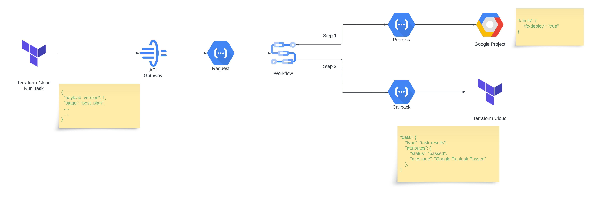

# terraform-gcp-runtask-budgets

## Overview
[Google Cloud Billing Budgets](https://cloud.google.com/billing/docs/how-to/budgets) provides the ability to set up alerts and manage costs. However, these do not prevent additional costs incurring once budgets have been exceeded.

In order to cap spending Cloud Pub/Sub and Cloud Function integration needs to be implemented to perform necessary action. The diagram below shows an example of this using a Cloud Function to programmatically remove the billing account from the Google project.  However, this is an aggressive approach to cost control, should only be used in non production environments and where costs have significantly exceeded the budgets.


At the current time the Google Cloud Billing API is unable to provide realtime cost details.

A potential solution is for Google Cloud Billing Budgets automation to add a label (tfc-deploy) to the Google Project to disable Terraform deployments once 90% budget has been exceeded. The project label can then be evaluated by Terraform Cloud Run Tasks in the post-plan stage during a Terraform Run and block further deployments.

In order to correctly identify the target google projects, the Google terraform provider configuration block needs to specify the `project` parameter explicitly or via a input variable.
```hcl
provider google {
  project = "__GOOGLE_PROJECT_ID__"
}
```
```hcl
provider google {
  project = var.project
}
```

## Architecture
The diagram below shows the Terraform Run Task components leveraging low cost serverless Google Cloud resources.



Resources created in Google Cloud are:
- API Gateway
- Cloud Functions - callback, process, request
- Cloud Storage Bucket
- Service Accounts
- Workflow

## Pre-Requisites
Pre-requisites for TFC Run Task deployment only:
- Google Cloud SDK
- Google Cloud project with owner permissions
- Google Cloud credentials setup
  - gcloud auth application-default login
  - gcloud auth login
- Makefile
- Terraform v1.4+
- Terraform Cloud account and workspace created
- Terraform sample deployment to connect to the above workspace

Additional pre-requisites for cloud function development:
- Python 3.10+
- Python IDE, e.g. PyCharm
- pytest for running unit tests
- requests library for HTTP client functionality

## Deploy
### Google Cloud
Create a file in the terraform folder named terraform.tfvars.
```hcl
project_id = "__DEPLOYMENT_GOOGLE_PROJECT__"
project_viewer = ["__BUDGET_GOOGLE_PROJECT__"]
```

- project_id - Google project id for deploying the TFC Run Task
- project_viewer - Google project ids to assign viewer IAM role to allow cloud function service account to read project labels.

Navigate to the `terraform` folder in the terminal and execute the commands below to deploy the Google Cloud resources.
```bash
make init
make plan
make apply
```
or
```bash
make all
```
### Terraform Cloud
[Terraform Cloud](https://app.terraform.io) Run Task set up is required next. Under `Settings/Run tasks` create a Run Task with the following settings:
- Endpoint URL - Terraform output variable `api_gateway_endpoint_uri`
- HMAC key - Should match the terraform input variable `hmac_key`

Next, go to the Terraform Cloud workspace. Under `Settings\Run Tasks` add the Run Task with the following settings:
- Run stage - Post-plan
- Enforcement level - Advisory or Mandatory

### Terraform Sample Deployment
Use an existing Terraform sample deployment to test the TFC Run Task budgets functionality using the CLI driven workflow.

If you have no sample deployment, utilise the following Terraform HCL.
```hcl
provider "google" {
  project = "__GOOGLE_PROJECT_ID__"
}

data "google_client_openid_userinfo" "userinfo" {}

data "google_project" "current" {}

output "project" {
  value = data.google_project.current
}

output "userinfo" {
  value = data.google_client_openid_userinfo.userinfo
}
```
* Add the Terraform Cloud backend to your sample deployment using the instructions from the TFC Workspace.
* Setup TFC CLI credentials by running the command `terraform login`
* Add the project label `tfc-deploy` with the value `true` or `false` to the Google Cloud Project.
* Execute the terraform commands: `terraform init`, `terraform plan`, `terraform apply`
* The Terraform Cloud deployment will be blocked if `tfc-deploy=false` and workspace run task enforcement level is set to `mandatory`

## Destroy
All the resources deployed to the Google Cloud project can be destroyed with the single command below.
```bash
make destroy
```

## Run Task Development
The cloud functions for this TFC Run Task are in the folders below:
- [callback](cloud_functions/runtask_callback) - Posts results back to Terraform Cloud
- [process](cloud_functions/runtask_process) - Downloads plan JSON, validates deployments
- [request](cloud_functions/runtask_request) - Validates webhooks, triggers async processing
- [echo](cloud_functions/runtask_echo) - Debug/testing utility function

### Development Commands

Each cloud function supports local development with the following commands:
```bash
cd cloud_functions/runtask_*
make run      # Start local development server
make build    # Build container with buildpacks
make test     # Test locally with curl
```

### Testing

**Unit Tests:**
```bash
cd cloud_functions/tests
pytest -v
```

**Integration Tests:**
```bash
cd tests
pytest -v
```

Cloud Function pytests have been created in the folder [cloud_functions/tests](cloud_functions/tests) to aid local development and unit testing. All tests include comprehensive coverage of:
- Input validation
- Error handling
- Security features
- Mock object compatibility

Terraform pytests have been created in the folder [tests](tests) to deploy, test and destroy resources.

### Security Testing

The test suite includes security-focused test cases:
- Sensitive data sanitization verification
- Request size limit validation
- HMAC signature validation
- Input validation boundary testing

Run security-specific tests:
```bash
pytest -v -k "security or validation or sanitiz"
```

## Configuration

### Environment Variables

The following environment variables can be configured for enhanced security and performance:

**Security Settings:**
- `LOG_LEVEL`: Logging level (DEBUG, INFO, WARNING, ERROR)
- `DISABLE_SENSITIVE_LOGGING`: Set to 'true' to disable sensitive data logging
- `MAX_REQUEST_SIZE`: Maximum request payload size in bytes (default: 10MB)

**Performance Settings:**
- `HTTP_TIMEOUT`: HTTP request timeout in seconds (default: 30)
- `MAX_CONCURRENT_REQUESTS`: Maximum concurrent request limit (default: 100)

**Feature Flags:**
- `ENABLE_STRUCTURED_LOGGING`: Enable structured JSON logging (default: false)
- `ENABLE_PERFORMANCE_MONITORING`: Enable performance metrics (default: false)

### Required Environment Variables

**For Cloud Functions:**
- `HMAC_KEY`: Terraform Cloud webhook validation key
- `TFC_ORG`: Terraform Cloud organization filter
- `WORKSPACE_PREFIX`: Workspace name filter
- `RUNTASK_PROJECT`: Google Cloud project for resources
- `TFC_PROJECT_LABEL`: Project label to check (default: "tfc-deploy")

## Troubleshooting

### Common Issues

**Authentication Errors:**
- Verify HMAC_KEY matches Terraform Cloud configuration
- Check TFC_ORG and WORKSPACE_PREFIX settings
- Ensure Google Cloud credentials are properly configured

### Debug Mode

Enable debug logging by setting `LOG_LEVEL=DEBUG` environment variable for detailed troubleshooting information.
