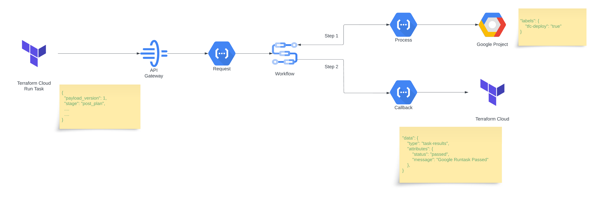

# terraform-gcp-runtask-budgets

## Overview
[Google Cloud Billing Budgets](https://cloud.google.com/billing/docs/how-to/budgets) provides the ability to set up alerts and manage costs. However, these do not prevent additional costs incurring once budgets have been exceeded.

In order to cap spending Cloud Pub/Sub and Cloud Function integration needs to be implemented to perform necessary action. The diagram below shows an example of this using a Cloud Function to programmatically remove the billing account from the Google project.  However, this is an aggressive approach to cost control, should only be used in non production environments and where costs have significantly exceeded the budgets.


At the current time the Google Cloud Billing API is unable to provide realtime cost details.

A potential solution is for Google Cloud Billing Budgets automation to add a label (tfc-deploy) to the Google Project to disable Terraform deployments once 90% budget has been exceeded. The project label can then be evaluated by Terraform Cloud Run Tasks in the post-plan stage during a Terraform Run and block further deployments.

In order to correctly identify the target google projects, the Google terraform provider configuration block needs to specify the `project` parameter explicitly or via a input variable.
```hcl
provider google {
  project = "__GOOGLE_PROJECT_ID__"
}
```
```hcl
provider google {
  project = var.project
}
```

## Architecture
The diagram below shows the Terraform Run Task components leveraging low cost serverless Google Cloud resources.



Resources created in Google Cloud are:
- API Gateway
- Cloud Functions - callback, process, request
- Cloud Storage Bucket
- Service Accounts
- Workflow

## Pre-Requisites
Pre-requisites for TFC Run Task deployment only:
- Google Cloud SDK
- Google Cloud project with owner permissions
- Google Cloud credentials setup
  - gcloud auth application-default login
  - gcloud auth login
- [Task](https://taskfile.dev/) (task automation tool)
- Terraform v1.10+
- Terraform Cloud account and workspace created
- Terraform sample deployment to connect to the above workspace

Additional pre-requisites for cloud function development:
- Python 3.13+
- Python IDE, e.g. PyCharm

## Deploy
### Google Cloud
Create a file in the terraform folder named terraform.tfvars.
```hcl
project_id     = "__DEPLOYMENT_GOOGLE_PROJECT__"
project_viewer = ["__BUDGET_GOOGLE_PROJECT__"]
hmac_key       = "__RUN_TASK_HMAC_KEY__"
```

- project_id - Google project id for deploying the TFC Run Task
- project_viewer - (optional) Google project ids to assign viewer IAM role to allow cloud function service account to read project labels.
- hmac_key - (optional) HMAC key shared with the TFC Run Task; defaults to `secret`, so override it for real deployments.
- region - (optional) defaults to `europe-west1`.

From the repository root, execute the commands below to deploy the Google Cloud resources.
```bash
task init
task terraform:plan
task terraform:apply
```
or
```bash
task terraform:all
```
### Terraform Cloud
[Terraform Cloud](https://app.terraform.io) Run Task set up is required next. Under `Settings/Run tasks` create a Run Task with the following settings:
- Endpoint URL - Terraform output variable `api_gateway_endpoint_uri`
- HMAC key - Should match the terraform input variable `hmac_key`

Next, go to the Terraform Cloud workspace. Under `Settings\Run Tasks` add the Run Task with the following settings:
- Run stage - Post-plan
- Enforcement level - Advisory or Mandatory

### Terraform Sample Deployment
Use an existing Terraform sample deployment to test the TFC Run Task budgets functionality using the CLI driven workflow.

If you have no sample deployment, utilise the following Terraform HCL.
```hcl
provider "google" {
  project = "__GOOGLE_PROJECT_ID__"
}

data "google_client_openid_userinfo" "userinfo" {}

data "google_project" "current" {}

output "project" {
  value = data.google_project.current
}

output "userinfo" {
  value = data.google_client_openid_userinfo.userinfo
}
```
* Add the Terraform Cloud backend to your sample deployment using the instructions from the TFC Workspace.
* Setup TFC CLI credentials by running the command `terraform login`
* Add the project label `tfc-deploy` with the value `true` or `false` to the Google Cloud Project.
* Execute the terraform commands: `terraform init`, `terraform plan`, `terraform apply`
* The Terraform Cloud deployment will be blocked if `tfc-deploy=false` and workspace run task enforcement level is set to `mandatory`

## Destroy
All the resources deployed to the Google Cloud project can be destroyed with the single command below.
```bash
task terraform:destroy
```

## Run Task Development
The cloud functions for this TFC Run Task are in the folders below:
- [callback](cloud_functions/runtask_callback)
- [process](cloud_functions/runtask_process)
- [request](cloud_functions/runtask_request)

Cloud Function pytests have been created in the folder [cloud_functions/tests](cloud_functions/tests) to aid local development and unit testing (`task test:cf`). Tests that read project labels need application-default credentials and a default project (`gcloud config set project <id>`).

Terraform pytests have been created in the folder [tests](tests) to deploy, test and destroy resources (`task test:terraform` - this deploys real resources).

Run `task lint` before committing, and `task --list` for all available tasks.

## Changelog

### 2026-10-07
- **chore**: Upgraded Cloud Functions runtime to Python 3.13 and aligned all Python dependency pins
- **chore**: Upgraded Terraform Google providers to 7.46 and declared archive, http and random providers
- **chore**: Upgraded GitHub Actions (checkout v7, setup-terraform v4, ubuntu-26.04 runner, Terraform 1.16.5)
- **chore**: Switched buildpacks builder to google-22
- **chore**: Updated pre-commit hooks and pinned ruff rule set in ruff.toml
- **ci**: Added Dependabot for GitHub Actions, pip, Terraform and pre-commit
- **ci**: Added Python workflow running cloud function pytests (GCP-dependent tests skipped)
- **fix**: Defaulted `project_viewer` to an empty list so plans succeed when it is unset

### 2026-03-17
- **feat**: Upgraded dependencies to Python 3.12 and added Task automation
- **refactor**: Replaced Terraform Makefile with Taskfile automation
- **chore**: Upgraded Terraform Google providers to 7.23.0
- **chore**: Updated pre-commit configuration
- **style**: Fixed linting issues and improved code quality
- **chore**: Improved .gitignore with Python best practices
